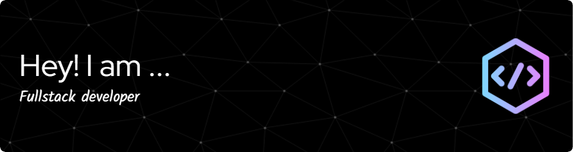

# I Research. I Refactor. I Reinvent.
# Hi, I’m Sumith Navalgund, a Software Developer Pushing Boundaries!
🛜 Currently working on my own webpage 👨🏼‍🎓 Studying M.Sc at R. V. College of Engineering College in Bengaluru 👨🏼‍💻 Web Developer  

# 💻 Tech Stack:
     
 
 
   
   

<picture>
  <source media="(prefers-color-scheme: dark)" srcset="https://raw.githubusercontent.com/tobiasmeyhoefer/tobiasmeyhoefer/output/github-snake-dark.svg" />
  <source media="(prefers-color-scheme: light)" srcset="https://raw.githubusercontent.com/tobiasmeyhoefer/tobiasmeyhoefer/output/github-snake.svg" />
  
</picture>

# 📫 Connect with me:

